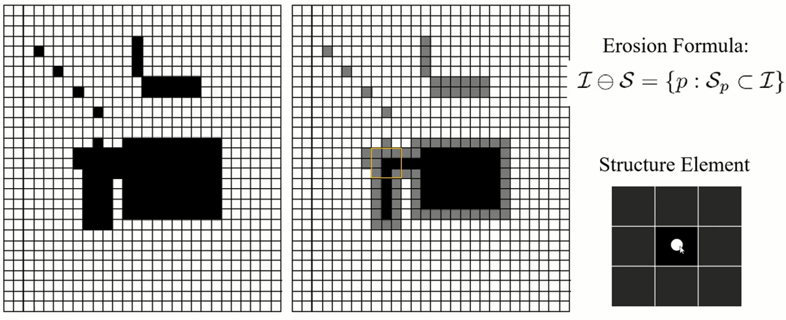
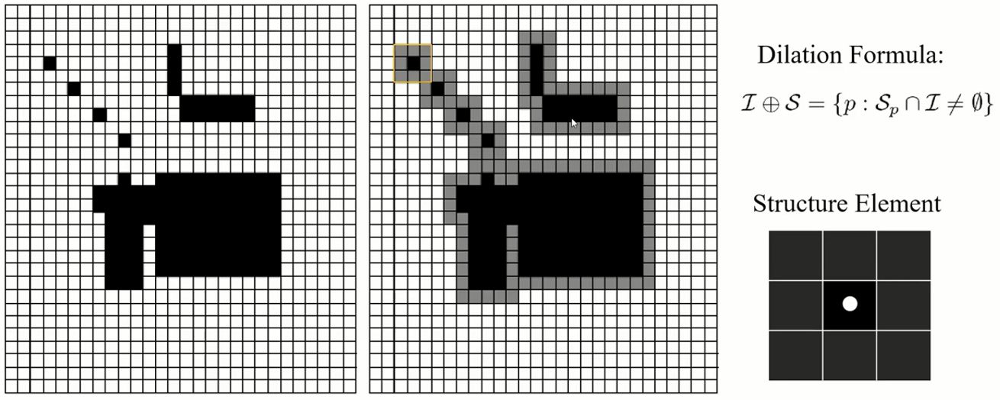
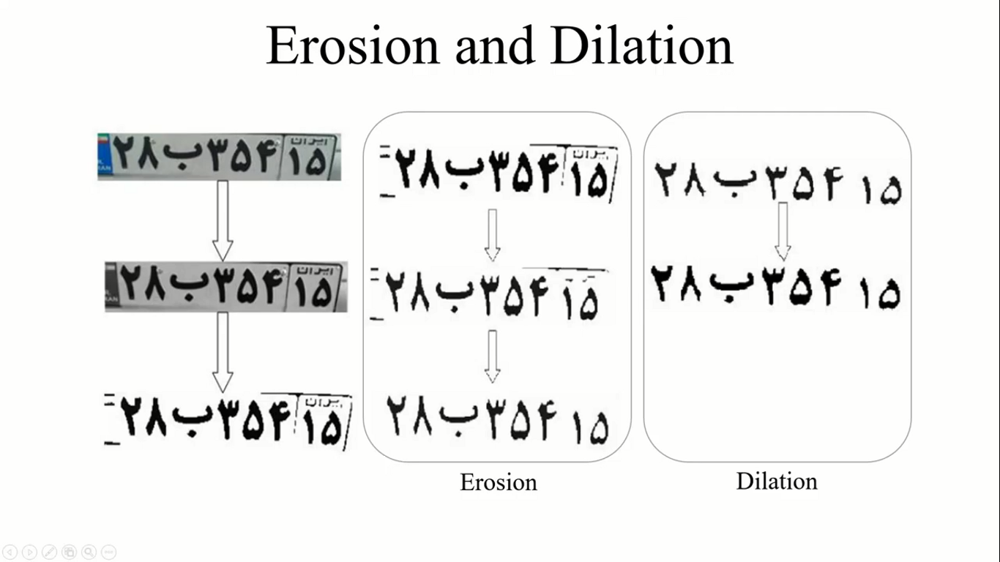

# OpenCV Tutorial📸

Welcome to our OpenCV tutorial! In this guide, we will take you through basic image and video operations, as well as essential image processing techniques. From reading and displaying images to advanced techniques like edge detection, erosion, and dilation, this guide covers it all. Let's dive in! 🚀

---

## Read and Show Image Preview 🖼️

To read an image and display it, we can use the following code:

### Read an image:
```python
image = cv.imread('img/1.jpg')
```
This will read the image and convert it into a matrix format.

### Display the image:
To display the image, we use `cv.imshow()` and `cv.waitKey()`. The `waitKey()` function is important because it ensures that the image window stays open for a certain time (in milliseconds).

#### Example:
```python
cv.imshow('my image', image)
cv.waitKey(delay=10000)  # Waits for 10 seconds before closing
```

- You can set `delay=0` to keep the image window open indefinitely:
```python
cv.imshow('my image', image)
cv.waitKey(delay=0)
```

---

## **Read and Show Video Preview 🎥**

To work with videos, we need to use `cv.VideoCapture()` to load the video file. The `cap.read()` method returns two outputs:
1. The status of the video (True if the video is still running, False if it ends).
2. A single frame from the video.

### Example of displaying a video:
```python
cap = cv.VideoCapture('path_to_video.mp4')

while True:
    status, frame = cap.read()
    if not status:
        break  # Break the loop if the video ends

    cv.imshow("Video", frame)
    cv.waitKey(33)  # Waits for ~33ms to achieve a 30 FPS rate
```

#### Exit the video playback:
To stop the video playback by pressing a key (e.g., "q"), add this to the loop:
```python
if cv.waitKey(33) & 0xFF == ord("q"):
    break  # Stop the video when "q" is pressed
```

---

## **Create Blank Images 📝**

You can create black and white blank images using `np.zeros()` and `np.ones()`. The `zeros()` function creates a black image, and `ones()` creates a white image.

### Example:
```python
import numpy as np

black_blank_image = np.zeros((320, 320))
white_blank_image = np.ones((320, 320))

cv.imshow('Black Image', black_blank_image)
cv.imshow('White Image', white_blank_image)
cv.waitKey(0)
```

---

## **Draw Shapes and Text ✏️**

Now, let's add shapes like lines, rectangles, and circles, or even add text to our images.

### Draw a Line:
To draw a line, you need to specify the image, the starting point, the ending point, the color (in BGR format), and the thickness.

```python
cv.line(black_blank_image, (100, 100), (200, 200), (255, 0, 0), 2)
```
This draws a blue line from `(100, 100)` to `(200, 200)` with a thickness of 2.

### Draw a Rectangle:
The `cv.rectangle()` function works similarly to the line. You define the top-left and bottom-right corners, along with the color and thickness.

```python
cv.rectangle(black_blank_image, (200, 200), (300, 300), (255, 0, 0), 3)
```
Here, we draw a blue rectangle with a thickness of 3 pixels.

### Draw a Circle:
For circles, we specify the center coordinates, the radius, the color, and the thickness.

```python
cv.circle(black_blank_image, (100, 100), 30, (255, 0, 0), 3)
```
This draws a circle with a radius of 30 pixels centered at `(100, 100)`.

### Add Text:
To add text, we need to provide the image, the text string, the coordinates for the text position, the font face, font size, and the color.

```python
cv.putText(black_blank_image, "Hello World", (100, 100), cv.FONT_HERSHEY_COMPLEX, 1, (255, 0, 0))
```
This adds the text "Hello World" at coordinates `(100, 100)` using a complex font style with size 1 and a blue color.

---
## 1. Resizing and Cropping 🔄

### Resizing an Image
To resize an image in OpenCV, use the `cv.resize()` function. It takes:
1. The target image.
2. The desired size.

```python
image = cv.imread(filepath)
resized_image = cv.resize(image, (200, 200))  # Resize to 200x200 pixels
```

### Cropping an Image ✂️
OpenCV doesn't have a direct cropping function. You can slice the image matrix manually by specifying coordinates of the desired section.

```python
cropped_image = image[y:y+h, x:x+w]
```

**Example:**

```python
cropped_image = image[100:400, 200:450]  # Crop region from (200,100) to (450,400)
```

---

## Changing Image Channels 🎨

OpenCV images are in BGR format by default, which can cause color issues when using libraries like `matplotlib` that expect RGB. Convert color channels as needed.

### Convert to RGB
To switch from BGR to RGB:

```python
rgb_image = cv.cvtColor(image, cv.COLOR_BGR2RGB)
```

### Convert to Grayscale
To convert the image to grayscale:

```python
gray_image = cv.cvtColor(image, cv.COLOR_BGR2GRAY)
```

This approach allows you to work with different color formats supported by OpenCV.

---

## Blurring Images 🌫️

Blurring an image softens it by averaging nearby pixel values. A Gaussian blur can be applied using `cv.GaussianBlur()`.

```python
blurred_image = cv.GaussianBlur(image, (9, 9), 2)
```

**Inputs:**
- `image`: The target image.
- `(9, 9)`: Kernel size, which should be odd.
- `2`: Sigma value controlling blur intensity.

Increasing kernel size or sigma creates a stronger blur effect.

---

## Canny Edge Detection 🧑‍💻

Canny edge detection highlights rapid intensity changes in an image, useful for finding edges.

```python
edges = cv.Canny(image, 100, 200)
```

**Inputs:**
1. `image`: The target image.
2. `100` and `200`: Threshold values for sensitivity. Lower values increase sensitivity, while higher values make edge detection more selective.

---

## Erosion and Dilation 🌌

Erosion and dilation are morphological transformations useful for refining image details and separating connected components.

### Erosion 🌑
Erosion removes pixels from object boundaries, useful for separating objects in noisy images.


```python
eroded_image = cv.erode(image, kernel, iterations=3)
```
The central pixel is preserved only if the structuring element fully overlaps the object.



### Dilation 🌕
Dilation expands object boundaries, filling in small gaps.

```python
dilated_image = cv.dilate(image, kernel, iterations=8)
```

The central pixel is added if any part of the structuring element overlaps the object.



### Example

Below is an example of image processing for license plate detection. We:
1. Convert the image to grayscale.
2. Apply a binary threshold.
3. Use erosion and dilation to refine object boundaries.

**Inputs:**
- `image`: The target image.
- `kernel`: A matrix defining the size and shape of the structuring element.
- `iterations`: Number of times to apply the operation.

```python
image_edges = cv.Canny(image, 200, 200)

kernel = np.ones((5, 5), dtype="uint8")  # Structuring element: white squares

# Apply dilation and erosion
dilated_image = cv.dilate(image_edges, kernel, iterations=8)
eroded_image = cv.erode(dilated_image, kernel, iterations=3)

cv.imshow('Edges', image_edges)
cv.imshow('Dilated Image', dilated_image)
cv.imshow('Eroded Image', eroded_image)

cv.waitKey(0)
```

### Visual Examples:



---

## Key Points to Remember:
- **Color Format**: OpenCV uses **BGR** (Blue, Green, Red) instead of the more common RGB (Red, Green, Blue).
- **waitKey()**: Used to display images or videos until a key is pressed or a certain amount of time has passed.
- **Video Capture**: Use `cv.VideoCapture()` and `.read()` to fetch each frame from a video in a loop.

---

Happy coding! 🎉 Stay tuned for more tutorials on OpenCV and image/video processing.
